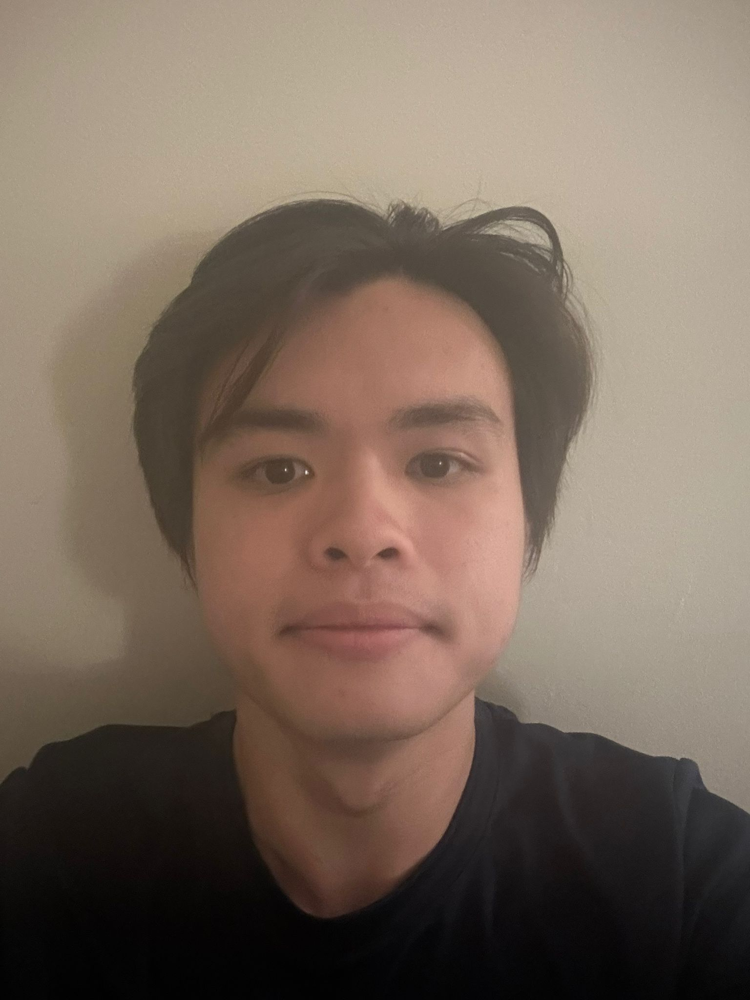
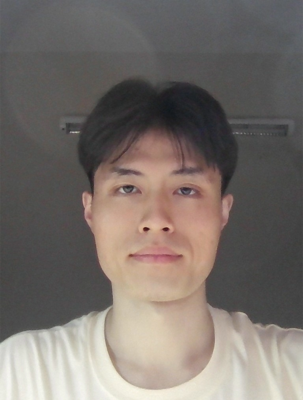

# About Us

We are a team based in the [School of Computing, National University of Singapore](http://www.comp.nus.edu.sg).

You can reach us at the email `abhishekparanjape[at]comp.nus.edu.sg`

## Project team

### Randall Koh

[[github](https://github.com/randalliasdanx)]

- Role: Software Engineer

### Dayne Tang

[[github](http://github.com/daynerss1)]

* Role: Feature Developer
* Responsibilities: UI
* Tutor: Sky

### Ray Chua

[[[homepage]](https://stinkray77.github.io)]
[[github](http://github.com/stinkray77)]

* Role: Software Developer
* Responsibilities: Data

### Tan Yi Zhong

[[github](http://github.com/bombyz003)]

- Role: Developer
- Responsibilities: Dev Ops + Threading

### Abhishek Paranjape

[[github](http://github.com/AbhishekParanjape)]

* Role: Software Engineer
* Responsibilities: CI + CD
