---

layout: default.md
title: "User Guide"
pageNav: 3
---

# TutorCentral User Guide

TutorCentral is a **desktop app for freelance tutors in Singapore** to manage student information, optimised for use via a **Command Line Interface** (CLI) while still having the benefits of a Graphical User Interface (GUI). Whether you are tracking payments, recording attendance, or scheduling lessons, TutorCentral keeps everything organised in one place. If you can type fast, TutorCentral can get your student management tasks done faster than traditional GUI apps.

### Key Features

- Manage student profiles (add, edit, delete, view)
- Track payment status (mark as Paid, Due, or Overdue)
- Record and review attendance for lessons
- Search and filter students by name, subject, day, payment status, or tags
- Add remarks and notes per student
- Schedule lessons with day/time tracking

### Using this guide

- **New users:** Start with [Quick Start](#quick-start) for step-by-step setup instructions.
- **Need help with a specific command:** Jump to [Command Summary](#command-summary) for a quick reference.
- **Want deeper understanding:** Explore the [Features](#features) section for detailed explanations of each command.
- **Developers:** Check the [Developer Guide](DeveloperGuide.md) for architecture and implementation details.

### Useful Notations and Glossary

| Term | Definition |
|------|------------|
| **GUI** | Graphical User Interface — the visual display of the application (windows, buttons, etc.) |
| **CLI** | Command Line Interface — a text-based interface where you type commands to interact with the app |
| **Command** | An instruction typed into the command box to perform an action (e.g., `add`, `delete`) |
| **Parameter** | A value supplied to a command, indicated by a prefix (e.g., `n/John` where `John` is the parameter) |
| **Index** | The number shown beside a student in the displayed list, used to refer to that student in commands |
| **Mainstream OS** | Windows, macOS, and Linux operating systems |
| **Tutor** | The user of TutorCentral — a freelance tutor managing their students |
| **Student** | A person being tutored, whose information is stored in TutorCentral |
| **Emergency Contact** | An 8-digit phone number of a person to contact in case of emergency for a student |
| **Attendance** | A record of whether a student was present, absent, or excused for a lesson |
| **Attendance Status** | One of: `Present`, `Absent`, or `Excused` — indicates a student's attendance for a specific lesson |
| **Payment Status** | One of: `Paid`, `Due`, or `Overdue` — indicates the current fee payment status of a student |
| **Subject** | An academic subject a student is enrolled in (e.g., `Mathematics`, `English`) |
| **Lesson** | A scheduled tutoring session associated with a subject |
| **Tag** | A short alphanumeric label attached to a student for categorisation (e.g., `priority`, `trial`) |
| **Remark** | A free-text note attached to a student for any additional information |

<!-- * Table of Contents -->
<page-nav-print />

--------------------------------------------------------------------------------------------------------------------

## Notes for Users

* **Launching the app:** Use `java -jar TutorCentral.jar` in a terminal rather than double-clicking the file, as double-clicking may not work on some systems.
* **Folder permissions:** The app needs to create and update files such as `preferences.json` and the `data/` folder. Place the JAR in a normal user-writable folder such as `Documents`, `Desktop`, or a personal project folder. Avoid protected system folders or read-only shared folders.
* **macOS fullscreen:** macOS users running the app in fullscreen mode may experience unexpected behaviour when opening secondary dialogs such as the Help window or the student view dialog. Use windowed mode instead.

--------------------------------------------------------------------------------------------------------------------

## Quick start

1. Ensure you have Java `17` installed in your Computer. Follow the instructions for your OS:
   * **Windows:** Download and install [Oracle JDK 17](https://www.oracle.com/java/technologies/downloads/#java17) or [Adoptium Temurin 17](https://adoptium.net/temurin/releases/?version=17).
   * **Mac:** Follow the precise installation steps in the [Mac installation guide](https://se-education.org/guides/tutorials/javaInstallationMac.html) on se-education.org. Alternatively, download [Oracle JDK 17](https://www.oracle.com/java/technologies/downloads/#java17) or [Adoptium Temurin 17](https://adoptium.net/temurin/releases/?version=17).
   * **Linux:** Run `sudo apt install openjdk-17-jdk`, or download binaries from [Oracle JDK 17](https://www.oracle.com/java/technologies/downloads/#java17) or [Adoptium Temurin 17](https://adoptium.net/temurin/releases/?version=17).

2. Download the latest `.jar` file from [here](https://github.com/AY2526S2-CS2103T-T09-2/tp/releases).

3. Copy the file to the folder you want to use as the _home folder_ for your TutorCentral.

4. Open a command terminal, `cd` into the folder you put the jar file in, and use the `java -jar tutorcentral.jar` command to run the application. 
   The initial app state after launch is shown below. Note how the app contains some sample data. 
   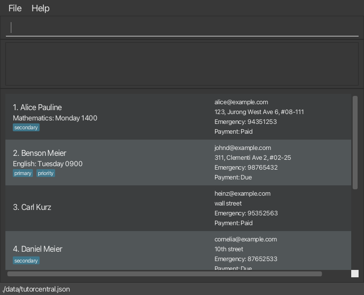

5. Type the command in the command box and press Enter to execute it. e.g. typing **`help`** and pressing Enter will open the help window. 
   Some example commands you can try:

   * `list` : Lists all students.

   * `add n/John Doe e/johnd@example.com a/John street, block 123, #01-01 ec/98765432` : Adds a student named `John Doe` to Tutor Central.

   * `delete 3` : Deletes the 3rd student shown in the current list.

   * `clear` : Deletes all students.

   * `exit` : Exits the app.

6. Refer to the [Features](#features) below for details of each command.

--------------------------------------------------------------------------------------------------------------------

## Features

<box type="info" seamless>

**Notes about the command format:** 

* Words in `UPPER_CASE` are the parameters to be supplied by the user. 
  e.g. in `add n/NAME`, `NAME` is a parameter which can be used as `add n/John Doe`.

* Items in square brackets are optional. 
  e.g. `n/NAME [t/TAG]` can be used as `n/John Doe t/friend` or as `n/John Doe`.

* Items with `…`​ after them can be used multiple times including zero times. 
  e.g. `[t/TAG]…​` can be used as ` ` (i.e. 0 times), `t/friend`, `t/friend t/family` etc.

* Parameters can be in any order. 
  e.g. if the command specifies `n/NAME e/EMAIL`, `e/EMAIL n/NAME` is also acceptable.

* Extraneous parameters for commands that do not take in parameters (such as `help`, `list`, `exit` and `clear`) will be ignored. 
  e.g. if the command specifies `help 123`, it will be interpreted as `help`.

* If you are using a PDF version of this document, be careful when copying and pasting commands that span multiple lines as space characters surrounding line-breaks may be omitted when copied over to the application.
</box>

**Parameter constraints:**

| Prefix | Field | Rules |
|--------|-------|-------|
| `n/` | Name | Alphanumeric characters and spaces, cannot be blank |
| `e/` | Email | Valid email format (e.g., `user@example.com`) |
| `a/` | Address | Any text, cannot be blank |
| `ec/` | Emergency Contact | Exactly 8 digits |
| `s/` | Subject | Alphanumeric characters and spaces; must not be blank |
| `d/` | Day | Monday-Sunday (or Mon-Sun), case-insensitive |
| `ti/` | Time | 4-digit 24-hour format, 0000-2359 |
| `ps/` | Payment Status | One of: `Paid`, `Due`, `Overdue` |
| `t/` | Tag | Alphanumeric characters, no spaces |
| `r/` | Remark | Any text (free-form) |
| `l/` | Lesson | Alphanumeric characters and spaces, cannot be blank |
| `st/` | Attendance Status | One of: `Present`, `Absent`, `Excused` |

**Important:** Days and times must be specified in matching pairs. If you provide 2 days, you must provide exactly 2 times.

### Viewing help : `help`

Shows a message explaining how to access the help page.

Format: `help`

Example result: A pop-up window will show you a link to this user guide with more detailed instructions.

### Adding a student: `add`

Adds a student to Tutor Central.

Format: `add n/NAME e/EMAIL a/ADDRESS ec/EMERGENCY_CONTACT [s/SUBJECT]… [d/DAY]… [ti/TIME]… [ps/PAYMENT_STATUS] [t/TAG]…`

<box type="tip" seamless>

**Tip:** A student can have any number of tags (including 0)
</box>

Examples:
* `add n/John Doe e/johnd@example.com a/311, Clementi Ave 2, #02-25 ec/98765432 s/Mathematics s/English d/Monday d/Wednesday ti/1400 ti/1600 ps/Due`

If `ps/PAYMENT_STATUS` is omitted, the student's payment status defaults to `Due`.

Example result after adding a student:
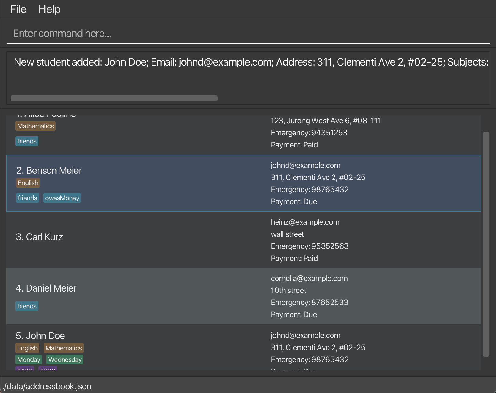

### Listing all students : `list`

Shows a list of all students in Tutor Central.

Format: `list`

Example result:
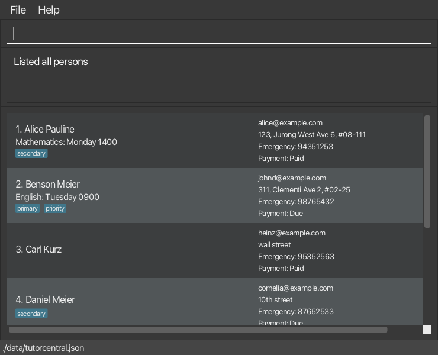

### Editing a student : `edit`

Edits an existing student in Tutor Central.

Format: `edit INDEX [n/NAME] [e/EMAIL] [a/ADDRESS] [ec/EMERGENCY_CONTACT] [s/SUBJECT]… [d/DAY]… [ti/TIME]… [ps/PAYMENT_STATUS] [t/TAG]…`

<box type="warning" seamless>

**Caution:** If you edit days (`d/`), you must also edit times (`ti/`), and vice versa.

</box>

* Edits the student at the specified `INDEX`. The index refers to the index number shown in the displayed student list. The index **must be a positive integer** 1, 2, 3, …​
* At least one of the optional fields must be provided.
* Existing values will be updated to the input values.
* When editing tags, the existing tags of the student will be removed i.e. adding of tags is not cumulative.
* You can remove all the student’s tags by typing `t/` without
    specifying any tags after it.

Examples:
*  `edit 1 e/johndoe@example.com` Edits the email address of the 1st student to be `johndoe@example.com`.
*  `edit 2 n/Betsy Crower t/` Edits the name of the 2nd student to be `Betsy Crower` and clears all existing tags.

Example result:
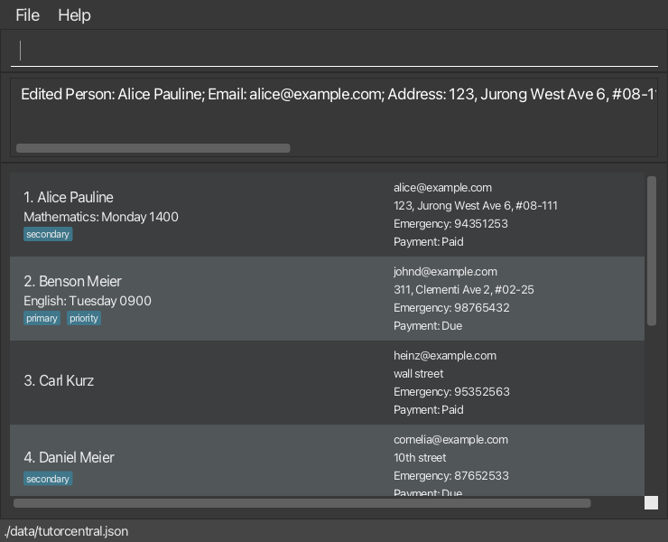

### Locating students: `find`

Finds students matching the given criteria.

Format: `find [n/NAME_KEYWORDS] [s/SUBJECT] [d/DAY] [ps/PAYMENT_STATUS] [t/TAG]`

* You can still search by name without prefixes using `find KEYWORD [MORE_KEYWORDS]`.
* When using prefixes, multiple criteria use AND logic.
* Name search is case-insensitive and matches full words only.
* Subject and tag searches are case-insensitive and match partial words.
* Day and payment status searches are case-insensitive exact matches.
* Payment status must be one of: `Paid`, `Due`, `Overdue`.

Examples:
* `find John` returns `john` and `John Doe`
* `find s/Mathematics` returns all students taking Mathematics
* `find d/Monday` returns all students with Monday lessons
* `find ps/Due` returns all students with unpaid fees
* `find s/Math d/Monday` returns students taking Math on Mondays
* `find t/priority` returns students tagged as priority

Example result for name-based search: `find John`
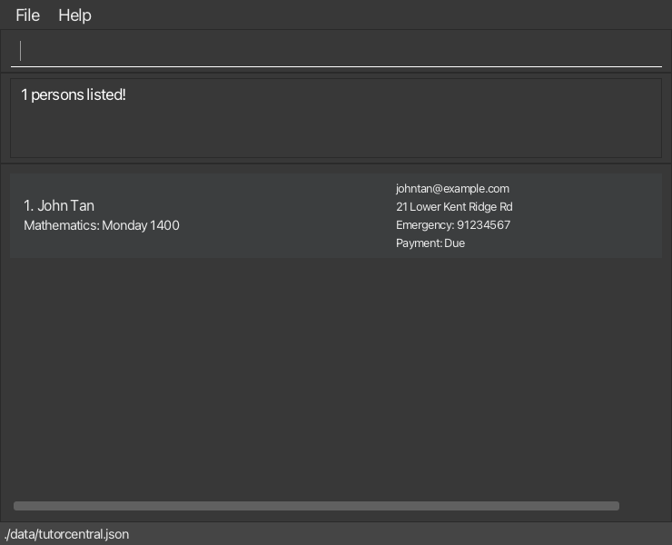

Example result for payment-status search: `find ps/Overdue`
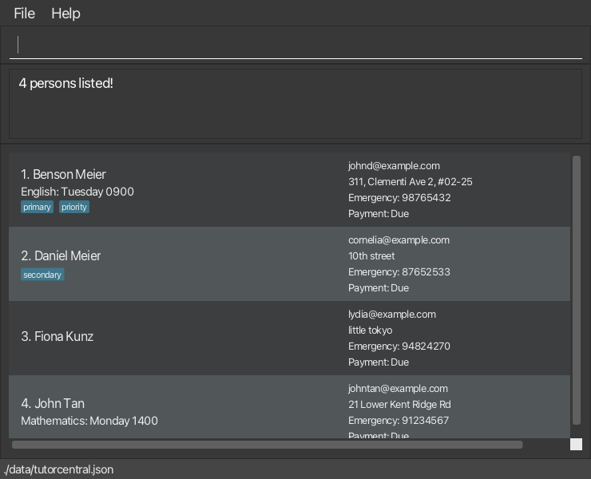

We can use the `list` command to go back to the default layout showing the details of all students.

### Viewing a student : `view`

Shows the full details of the student at the given index, in a pop-up window.

Format: `view INDEX`

* The index refers to the index number shown in the displayed student list.
* The index **must be a positive integer** 1, 2, 3, …​

Examples:
* `view 1` shows the full details of the 1st student in the current list.
* `find Alex` followed by `view 1` shows the full details of the 1st student in the filtered results.

Example result:
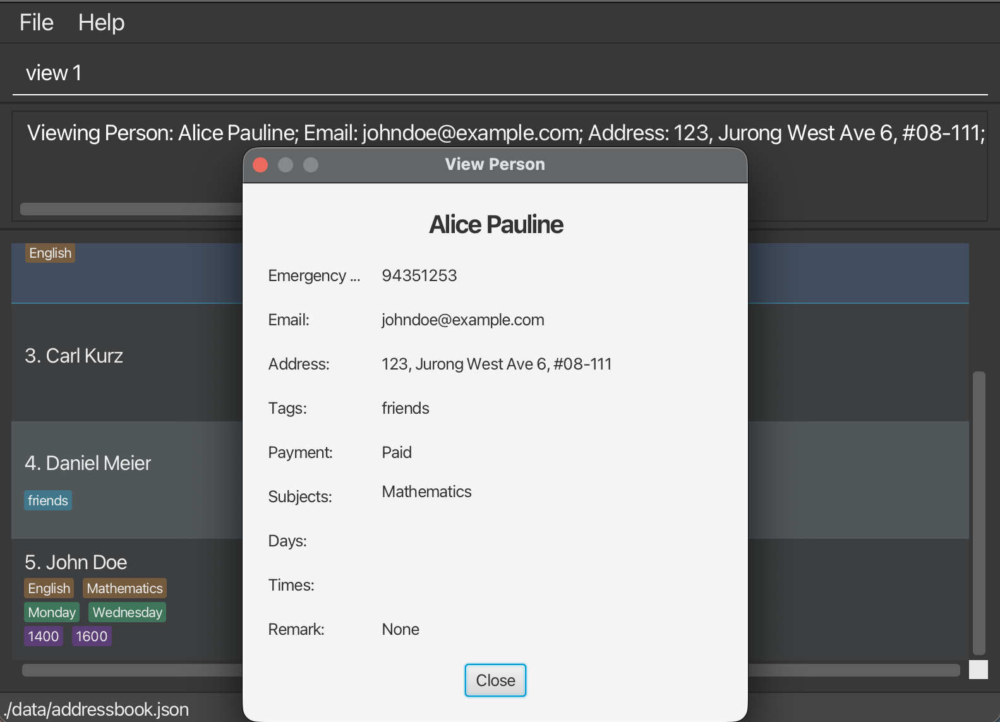

### Adding a remark to a student: `remark`

Adds or updates a free-text remark for the student at the given index. Useful for notes like "needs help with algebra" or "prefers morning lessons".

Format: `remark INDEX r/REMARK`

* The index refers to the index number shown in the displayed student list.
* The index **must be a positive integer** 1, 2, 3, ...
* The remark replaces any existing remark for that student.
* To remove a remark, use `remark INDEX r/` with nothing after `r/`.

Examples:
* `remark 1 r/Needs extra help with algebra` adds a remark to the 1st student.
* `remark 2 r/` removes the remark from the 2nd student.

Example result:
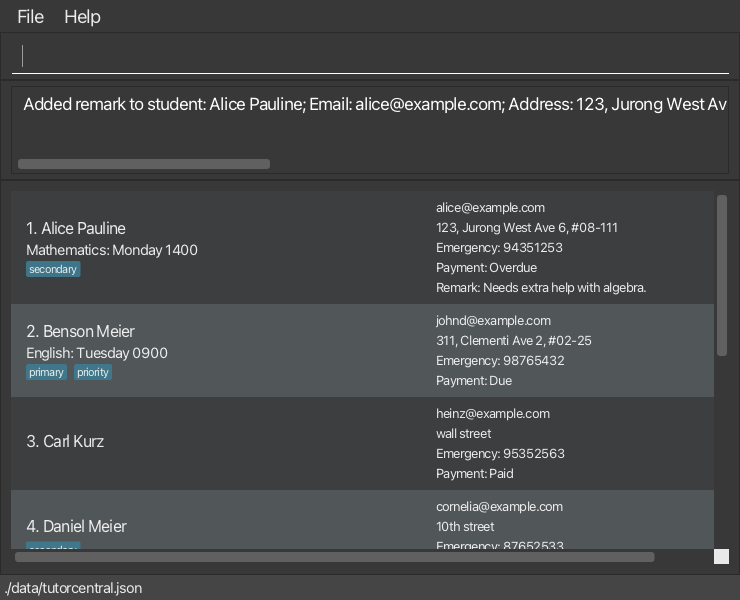

### Updating payment status: `mark`

Quickly updates the payment status of a student.

Format: `mark INDEX ps/PAYMENT_STATUS`

* The index refers to the index number shown in the displayed student list.
* The index **must be a positive integer** 1, 2, 3, ...
* Payment status must be one of: `Paid`, `Due`, `Overdue`.
* Payment status is case-insensitive, so `paid`, `PAID`, and `Paid` are all accepted.

Examples:
* `mark 1 ps/Overdue` marks the 1st student's payment as Overdue.
* `mark 3 ps/Paid` marks the 3rd student's payment as Paid.

Example result:
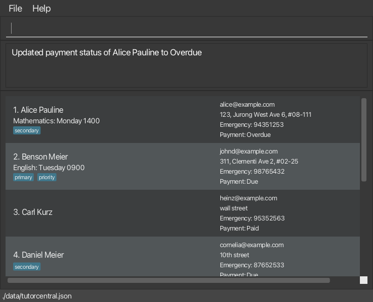

### Marking attendance: `markattendance`

Records a student's attendance for a specific lesson within a subject.

Format: `markattendance INDEX s/SUBJECT l/LESSON st/STATUS`

* The index refers to the index number shown in the displayed student list.
* The index **must be a positive integer** 1, 2, 3, ...
* The subject must match one of the student's existing enrolled subjects (case-insensitive).
* If an attendance record already exists for that subject and lesson combination, it is updated.
* If no record exists, a new one is created.

<box type="warning" seamless>

**Caution:**
* The student must be enrolled in the specified subject before attendance can be marked. Else, the command is blocked.
* The `INDEX` refers to the position in the **currently displayed list** — use `list` or `find` first if needed.
* Attendance status (`st/`) is case-insensitive (e.g., `present`, `Present`, and `PRESENT` are all accepted).
</box>

Examples:
* `markattendance 1 s/Mathematics l/Algebra Lesson 5 st/Absent` marks the 1st student as Absent for Algebra Lesson 5 in Mathematics.

Example result:
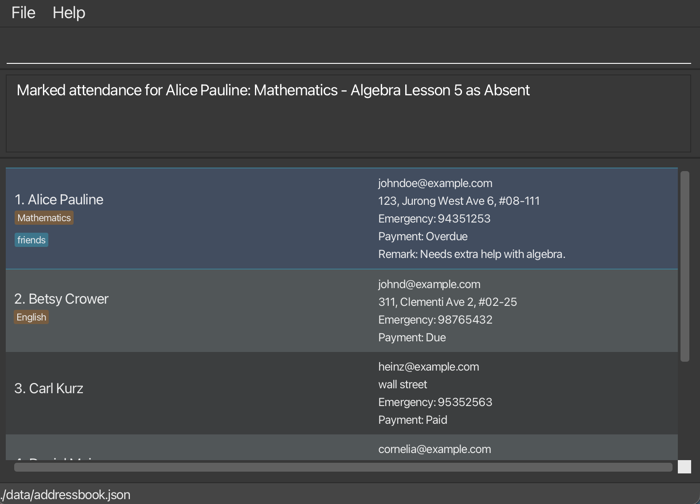
* `markattendance 1 s/Mathematics l/Algebra Lesson 5 st/Excused` can update the same record to Excused (e.g., after receiving an MC).
* `markattendance 3 s/Science l/Chemistry Lab 2 st/Absent`  is blocked, since the third student is not enrolled in the Science subject.

Example result:
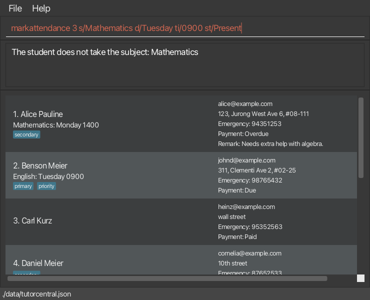

### Viewing attendance records: `listattendance`

Displays a student's attendance records, optionally filtered by subject.

Format: `listattendance INDEX [s/SUBJECT]`

* The index refers to the index number shown in the displayed student list.
* The index **must be a positive integer** 1, 2, 3, ...
* If `s/SUBJECT` is provided, only attendance records for that subject are shown (case-insensitive).
* Results are organised by subject and lesson in the result display area.
* If no attendance records exist, a message indicates this.

<box type="tip" seamless>

**Tip:** This is useful before parent meetings to quickly review a student's attendance history. Use after `markattendance` to verify attendance was recorded correctly.

</box>

Examples:
* `listattendance 1` shows all attendance records for the 1st student.
* `listattendance 1 s/Mathematics` shows only Mathematics attendance records for the 1st student.

Example result:
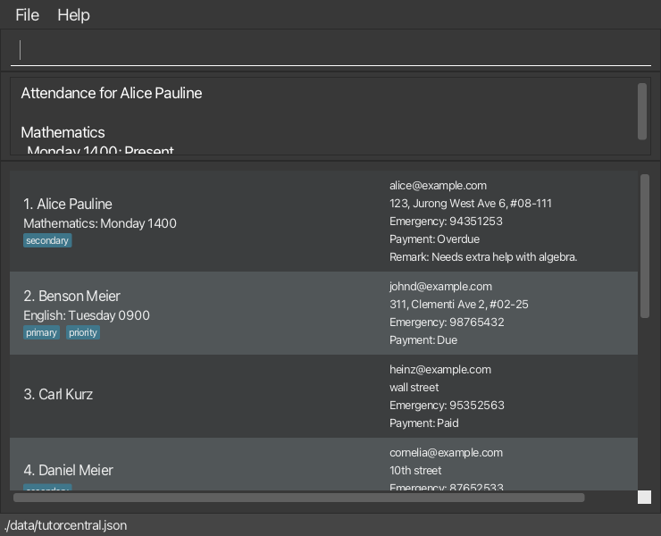

### Deleting a student : `delete`

Deletes the specified student from Tutor Central.

Format: `delete INDEX`

* Deletes the student at the specified `INDEX`.
* The index refers to the index number shown in the displayed student list.
* The index **must be a plain positive integer** 1, 2, 3, …​
* Inputs such as `+2` and `1.0` are not supported.
* The command only accepts one index input at a time.
* After a successful deletion, Tutor Central shows the full student list again.

Examples:
* `list` followed by `delete 2` deletes the 2nd student in Tutor Central.
* `find Betsy` followed by `delete 1` deletes the 1st student in the results of the `find` command.

Example result:
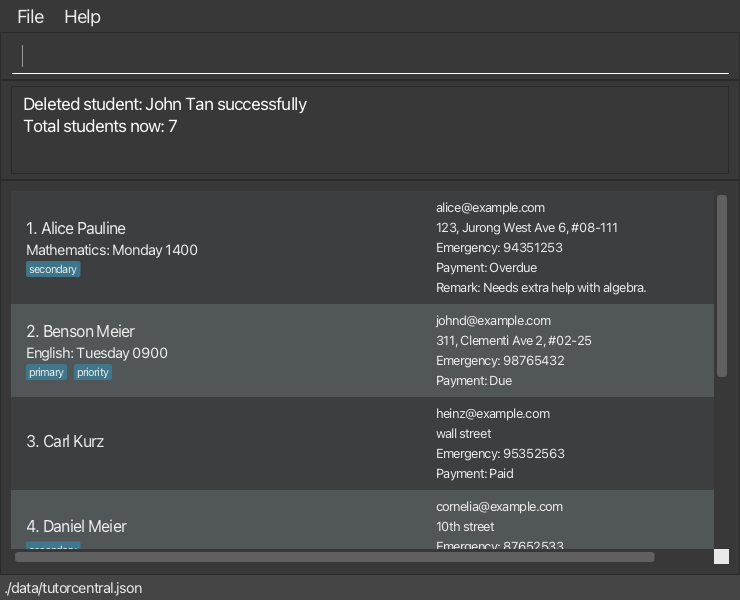

### Clearing all entries : `clear`

Clears all entries from Tutor Central.

Format: `clear`

### Exiting the program : `exit`

Exits the program.

Format: `exit`

### Saving the data

TutorCentral data are saved in the hard disk automatically after any command that changes the data. There is no need to save manually.

### Editing the data file

TutorCentral data are saved automatically as a JSON file `[JAR file location]/data/tutorcentral.json`. Advanced users are welcome to update data directly by editing that data file.

<box type="warning" seamless>

**Caution:**
If your changes to the data file makes its format invalid, TutorCentral will discard all data and start with an empty data file at the next run.  Hence, it is recommended to take a backup of the file before editing it. 
Furthermore, certain edits can cause the TutorCentral to behave in unexpected ways (e.g., if a value entered is outside the acceptable range). Therefore, edit the data file only if you are confident that you can update it correctly.
</box>

### Archiving data files `[coming in v2.0]`

_Details coming soon ..._

--------------------------------------------------------------------------------------------------------------------

## FAQ

**Q**: How do I transfer my data to another Computer? 
**A**: Install the app in the other computer and overwrite the empty data file it creates with the file that contains the data of your previous TutorCentral home folder.

**Q**: Where is the data file stored? 
**A**: By default, TutorCentral saves data in a `data` folder next to the JAR file, in a file called `tutorcentral.json`. Check the footer at the bottom of the app to see the exact path. Keep dated backups so you can revert if needed.

**Q**: How do I back up my data? 
**A**: Copy the data JSON file `[JAR file location]/data/tutorcentral.json` (or `addressbook.json` depending on your configuration) to a safe location such as your Downloads folder or an external drive. To restore from a backup, replace the data file with your backup copy.

**Q**: What if I accidentally corrupt the data file? 
**A**: If the data file contains invalid JSON, TutorCentral will start with an empty data set. Keep dated backups so you can revert if needed.

**Q**: Can I import data from Excel? 
**A**: TutorCentral does not currently support CSV/Excel import. Students need to be added using the `add` command. CSV import is planned for a future release.

**Q**: The app window disappeared from my screen. What do I do? 
**A**: Delete the `preferences.json` file in the same folder as the JAR and restart the app. This resets the window position.

**Q**: Is TutorCentral free? 
**A**: Yes, TutorCentral is free and open-source, built by NUS students for the tutor community.

--------------------------------------------------------------------------------------------------------------------

## Known issues

1. **When using multiple screens**, if you move the application to a secondary screen, and later switch to using only the primary screen, the GUI will open off-screen. The remedy is to delete the `preferences.json` file created by the application before running the application again.
2. **If you minimize the Help Window** and then run the `help` command (or use the `Help` menu, or the keyboard shortcut `F1`) again, the original Help Window will remain minimized, and no new Help Window will appear. The remedy is to manually restore the minimized Help Window.
3. **When using the `find` command with multiple prefixes** (e.g., `find s/Math d/Monday`), the results use AND logic. There is currently no way to perform OR searches across different fields.
4. **The `markattendance` command creates attendance records even if the lesson name doesn't match a previously used lesson name.** This means typos in lesson names (e.g., "Algbera" vs "Algebra") will create separate attendance records. Attendance records are currently not displayed in the student list cards in the GUI. Use the `listattendance` command to view them in the result display area.
5. **On macOS fullscreen mode, secondary dialogs may behave unexpectedly.** Commands that open separate windows, such as `help` and `view`, may not display as expected while the app is in fullscreen. Use windowed mode if this happens.

--------------------------------------------------------------------------------------------------------------------

## Command summary

| Action     | Format, Examples |
|------------|------------------|
| **Add**    | `add n/NAME e/EMAIL a/ADDRESS ec/EMERGENCY_CONTACT [s/SUBJECT]... [d/DAY]... [ti/TIME]... [ps/PAYMENT_STATUS] [t/TAG]...`   e.g., `add n/John Doe e/johnd@example.com a/Clementi Ave 2 ec/91234567 s/Mathematics d/Monday ti/1400 ps/Due` |
| **Clear**  | `clear` |
| **Delete** | `delete INDEX`   e.g., `delete 3` |
| **Edit**   | `edit INDEX [n/NAME] [e/EMAIL] [a/ADDRESS] [ec/EMERGENCY_CONTACT] [s/SUBJECT]... [d/DAY]... [ti/TIME]... [ps/PAYMENT_STATUS] [t/TAG]...`   e.g., `edit 1 e/johndoe@example.com` |
| **Exit**   | `exit` |
| **Find**   | `find [n/NAME] [s/SUBJECT] [d/DAY] [ps/PAYMENT_STATUS] [t/TAG]`   e.g., `find s/Mathematics d/Monday` |
| **Help**   | `help` |
| **List**   | `list` |
| **ListAttendance** | `listattendance INDEX [s/SUBJECT]`   e.g., `listattendance 1 s/Mathematics` |
| **Mark**   | `mark INDEX ps/PAYMENT_STATUS`   e.g., `mark 1 ps/Paid` |
| **MarkAttendance** | `markattendance INDEX s/SUBJECT l/LESSON st/STATUS`   e.g., `markattendance 1 s/Mathematics l/Algebra Lesson 5 st/Present` |
| **Remark** | `remark INDEX r/REMARK`   e.g., `remark 1 r/Needs help with algebra` |
| **View**   | `view INDEX`   e.g., `view 1` |
